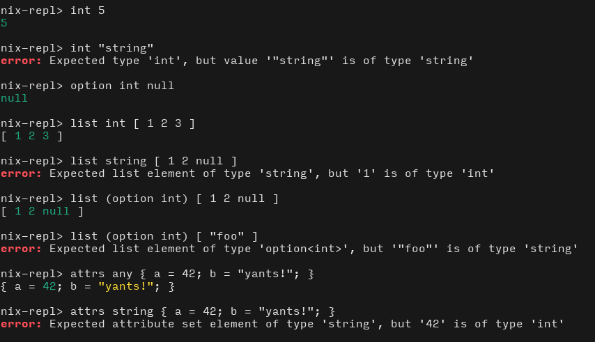
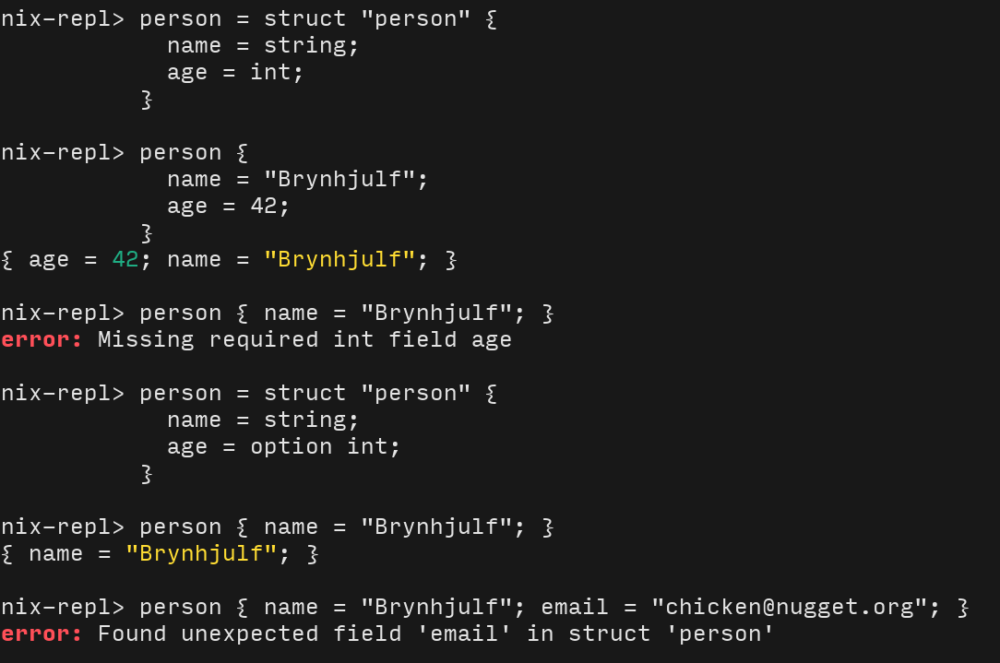
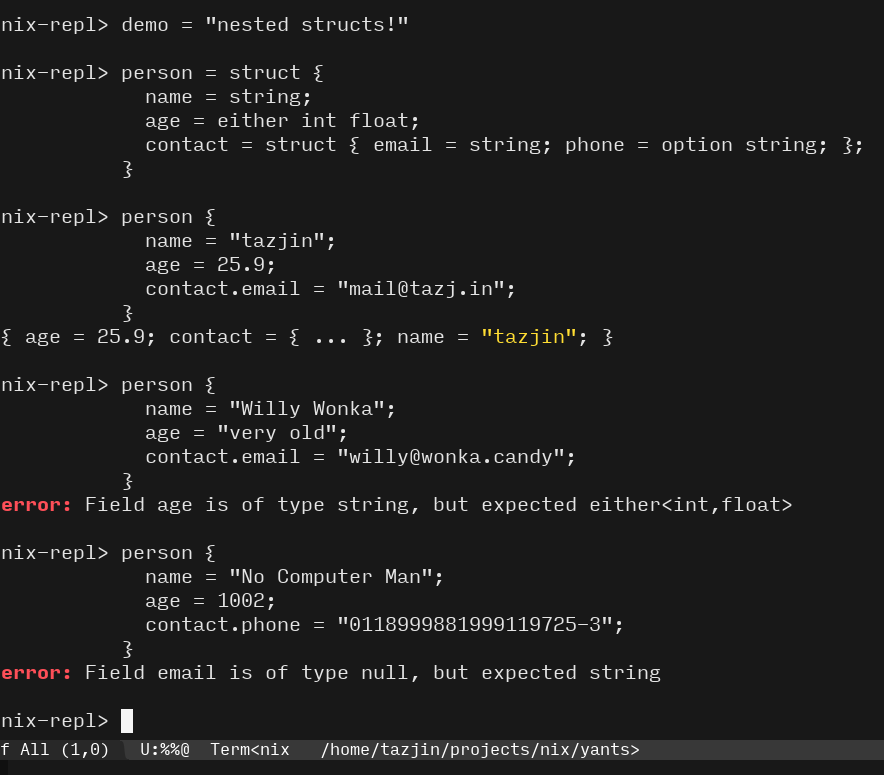
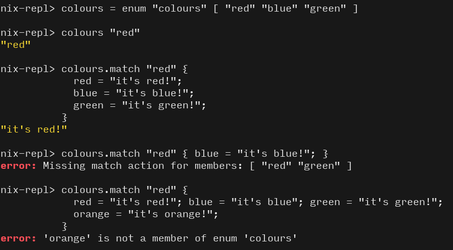
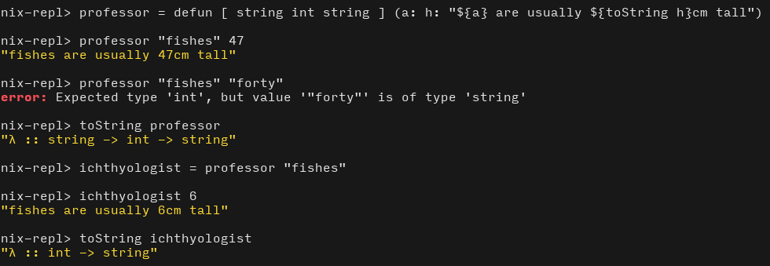

yants
=====

This is a tiny type-checker for data in Nix, written in Nix.

Features:

* Checking of primitive types (`int`, `string` etc.)
* Checking polymorphic types (`option`, `list`, `either`)
* Defining & checking struct/record types
* Defining & matching enum types
* Defining & matching sum types
* Defining function signatures (including curried functions)
* Types are composable! `option string`! `list (either int (option float))`!
* Type errors also compose!

Lacking:

* Any kind of inference
* Convenient syntax for attribute-set function signatures

## Primitives & simple polymorphism

## Structs

## Nested structs!

## Enums!

## Functions!

