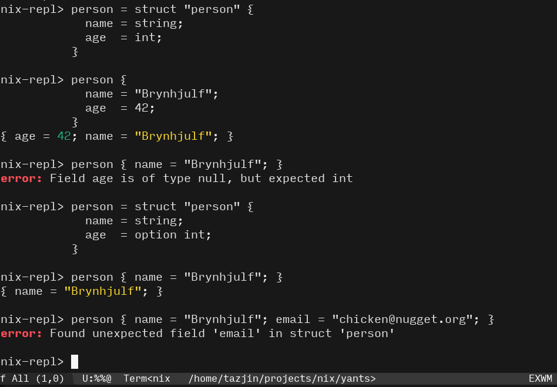

yants
=====

This is a tiny type-checker for data in Nix, written in Nix. It doesn't have all the features I think it should have (yet), but it works and its types are composable.

## Primitives & simple polymorphism

## Structs

## Nested structs!

